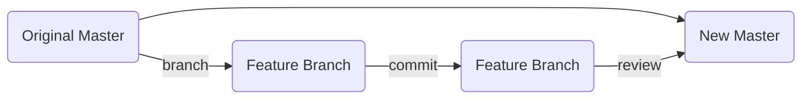

## How to Contribute to this Repo's DATA:
We  populate a google sheet. Some folks web-scrape and  some manually enter the data. Reach [via email](https://bit.ly/3aSlS9K) to get involved!

## How to Contribute to this Repo's CODE:
***Use feature-branch workflow***


Clone the Repo:
```bash
git clone git@github.com:john-telfeyan/self-paced-python-for-data-science.git
```
Then please use feature-branch workflow like so; First:
```bash
git checkout -b <feature-name>-<your-name>
```

Add only the required files and use a descriptive commit message like...
```bash
git add learn_python/for_loops.ipnb
git add learn_python/media_files/.
git commit -m "Added the 'FizzBuzz' challenge to for_loops.ipnb"
```
 ...then to push the new feature and I'll proof it before merging it:
```bash
git push --set-upstream origin <feature-name>-<your-name>
```

Thanks for reading and contributing!

> Written with [StackEdit](https://stackedit.io/).
<!--stackedit_data:
eyJoaXN0b3J5IjpbNTk0MzQxODIzXX0=
-->